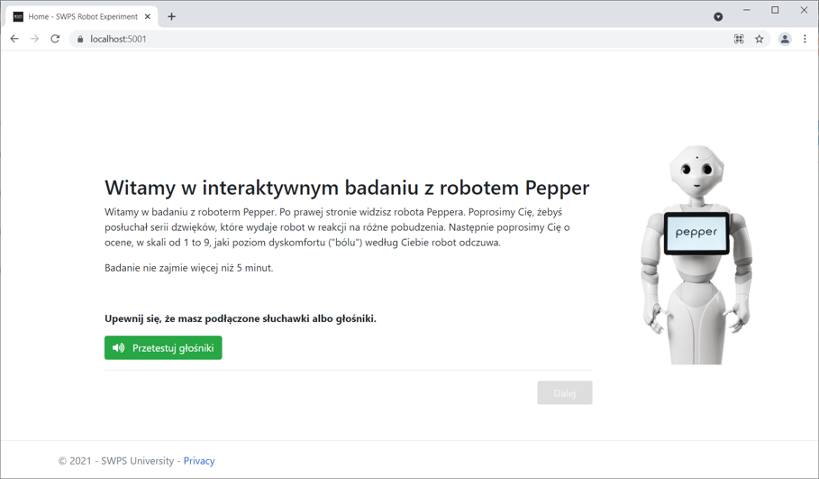


### Online interactive questionaire with audio files

This is online interactive questionaire with audio files.
Everything happens in jscript on the client side. Mixing REST API and Razor webpages in a single project.

Simple one page dynamic survey with jQuerry/Boostrap and SQLite with EF Core to be hosted on Azure. Simple, fast and effective.

##### Install Entity Framework Core

Using .NET Core CLI 

We have to install EF Core for the SQLite database provider.

```console
dotnet add package Microsoft.EntityFrameworkCore.Sqlite
```

or Package Manager console

```console
Install-Package Microsoft.EntityFrameworkCore.Sqlite
```


#### Database model

In our database we model one column for survey reponseses and a database context (SQLite). Each response has an ID, ResponseTime and JSON encoded answers.

In **EF Core**, by convention, a property named `Id` or `<type name>Id` will be configured as the primary key of an entity.

If you want to use different name for the key, you need to specify a `[Key]` attribute from `System.ComponentModel.DataAnnotations` namespace.

```csharp
    public class SurveyDbContext : DbContext
    {
        public DbSet<SurveyResponse> Responses { get; set; }

        public string DbPath { get; private set; }

        public SurveyDbContext()
        {
            var folder = Environment.SpecialFolder.LocalApplicationData;
            var path = Environment.GetFolderPath(folder);
            DbPath = $"{path}{System.IO.Path.DirectorySeparatorChar}blogging.db";
        }

        // The following configures EF to create a Sqlite database file in the
        // special "local" folder for your platform.
        protected override void OnConfiguring(DbContextOptionsBuilder options)
            => options.UseSqlite($"Data Source={DbPath}");
    }

    public class SurveyResponse
    {
        public int SurveyResponseId { get; set; }
        public DateTime ResponseTime { get; set; }

        public string ResponseJson { get; set; }
    }
```

#### Creating the database

Using .NET CLI:

```console
dotnet tool install --global dotnet-ef
dotnet add package Microsoft.EntityFrameworkCore.Design
dotnet ef migrations add InitialCreate
dotnet ef database update
```


#### Configure ASP.NET Host

Update `Startup.ConfigureServices()` method:

```csharp
    public void ConfigureServices(IServiceCollection services)
    {
        // ...
        services.AddEntityFrameworkSqlite().AddDbContext<SurveyDbContext>();
    }
```

Update `Startup.Startup()` method:

```csharp
    public Startup(IHostingEnvironment env)
    {
        using(var client = new SurveyDbContext())
        {
            client.Database.EnsureCreated();
        }
    }
```


### Server Backend

First we have to create new API Controller and add required Database context dependency injection.

```csharp
    [Route("api/[controller]")]
    [ApiController]
    public class DataController : ControllerBase
    {
        private readonly ILogger<DataController> _logger;
        private readonly SurveyDbContext _db;

        public DataController(ILogger<DataController> logger, SurveyDbContext db)
        {
            _logger = logger;
            _db = db;
        }

    }
```

We also need to map controller endpoints:

```csharp
public void Configure(IApplicationBuilder app, IWebHostEnvironment env)
{
    // ...
    app.UseEndpoints(endpoints =>
    {
        // ...
        endpoints.MapControllers();
    });
}
```


### API Controller actions for REST API

We can use REST controller paradigm. REST APIs should use attribute routing to model the app's functionality as a set of resources where operations are represented by HTTP verbs.

To make the code succunt we can pass a json object via post body (everything that is json can stored in the database).

```csharp
[Route("api/[controller]")]
[ApiController]
public class DataController : ControllerBase
{
    // ...

    [HttpGet]                   // GET /api/data/
    public JsonResult Get()
    {
        var total = _db.Responses.Count();
        return new JsonResult(new { total = total });
    }

    [HttpPost("create")]        // POST /api/data/create
    public async Task<JsonResult> PostCreateResponse([FromBody] System.Text.Json.JsonElement jsonResponse)
    {
        var record = new SurveyResponse
        {
            ResponseTime = DateTime.Now,
            ResponseJson = jsonResponse.ToString()
        };
        _db.Add(record);
        await _db.SaveChangesAsync();

        return new JsonResult(new { result = "ok" });
    }
}
```

## Web App

The webapplication is all writen a .cshtml with jQuery/Boostrap, so effectivel it is a single page that loads whole survey dynamically.

The language of the website is Polish.




#### Database

SQLite Database that was created on the server side will survive the consecutive application upddates/deployments and can be migrated without a loss of data.
